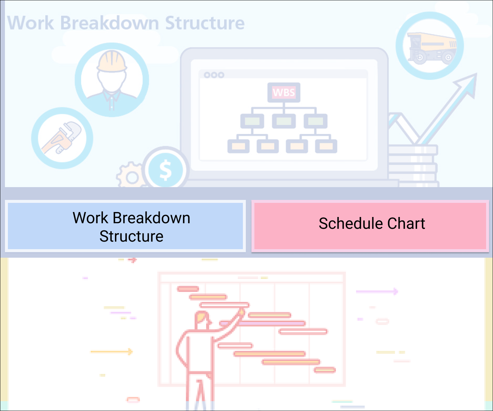

# Software Engineering project 

We have made a system which has two tools mainly:

* Work Breakdown Structure Generator
* Gantt Chart Maker Tool

**A landing page is provided which gives the option to navigate to either of these two tools**

  

# Screenshots:

## Landing page:-

  

  

## WBS Tool :- (once you click on WBS button on landing page) :-
  

  

## Gantt Tool :- (once you click on Gantt button on landing page) :-
  

  